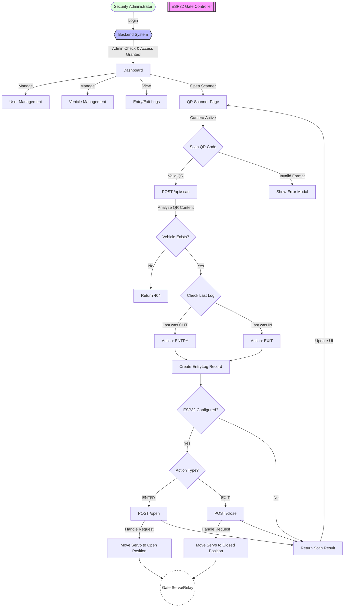

# Gate Security & Vehicle Management System Flow

This flowchart illustrates the end-to-end process of vehicle entry and exit management, including hardware integration with the ESP32 gate controller.

## Flow Description

1.  **Authentication**: Only users with the **admin** role can log in. The system initializes with a default admin account. Regular users registered in the system cannot log in to the web interface.
2.  **QR Scanning**: The authenticated administrator uses the device's camera to decode vehicle QR codes (Format: `VEHICLE:ID:PLATE`).
3.  **State Management**: The backend automatically toggles between **ENTRY** and **EXIT** based on the vehicle's last recorded movement.
4.  **Hardware Automation**:
    *   If the system identifies an **ENTRY**, it signals the ESP32 to open the gate.
    *   If it identifies an **EXIT**, it signals the ESP32 to close/reset the gate.
5.  **Logging**: Every scan is timestamped and stored in the database, including a link to the vehicle owner and optional images.
